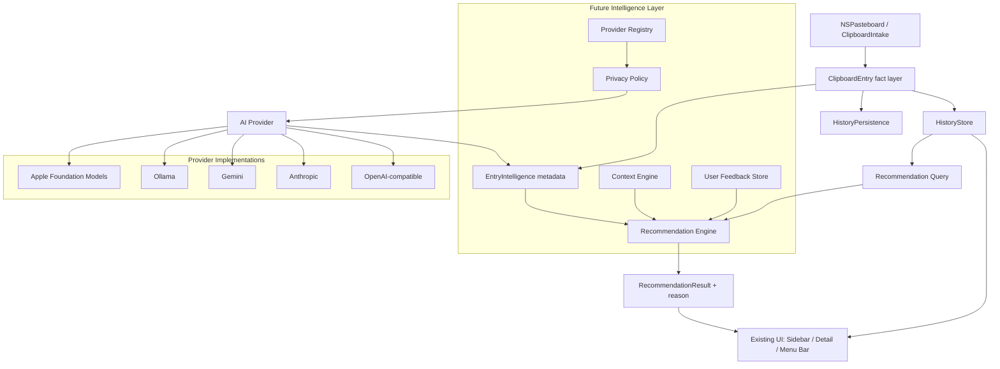

# AI 剪贴板系统架构草图



## 模块边界

### Fact Layer

`ClipboardEntry` 和 `ClipboardEntryContent` 表示用户确实复制过什么。这个层不应该依赖 AI。

### Intelligence Metadata Layer

`EntryIntelligence` 表示可重新生成的派生信息：摘要、标签、embedding、敏感性判断。它可以丢弃重建。

### Context Engine

采集“用户现在在哪里、可能在做什么”。它输出快照，不直接排序历史。

### Recommendation Engine

输入历史、智能元数据、上下文、反馈，输出候选列表和解释。

### Provider Layer

负责与模型服务通信。业务层不直接拼 provider-specific JSON。

### Privacy Gate

所有离开本机的数据必须经过 Privacy Gate。它决定允许、裁剪、脱敏或阻止。

## 数据流

### 复制时

```text
ClipboardIntake
→ ClipboardEntry
→ HistoryStore / Persistence
→ background intelligence queue
→ summary / tags / sensitivity / embedding
```

### 推荐时

```text
User invokes menu / hotkey / future predictive paste
→ ContextEngine captures snapshot
→ RecommendationEngine scores entries locally
→ optional AI rerank if allowed and fast enough
→ UI presents candidates with reasons
→ user action recorded as feedback
```

### 云端请求时

```text
Task request
→ PrivacyPolicy inspection
→ prompt/context minimization
→ ProviderRegistry selects provider
→ Provider executes
→ response parsed into app-native result
→ audit summary saved locally
```

## 近期代码落点

建议新增目录：

```text
ClipboardHistory/Sources/ClipboardHistoryApp/Intelligence/
    AIProviderModels.swift
    AIPrivacyPolicy.swift
    ContextSnapshot.swift
    RecommendationModels.swift
    EntryIntelligence.swift
    ClipboardEntryIntelligenceAdapter.swift
    RuleBasedRecommendationEngine.swift
    LocalRecommendationService.swift
```

初期只放类型，不接网络，不改变 UI。


## 已落地的第一块内核

当前 `Intelligence/` 已包含一个纯本地、无网络、无 UI 接入的规则推荐内核：

- `EntryIntelligence`：条目派生智能元数据，保存摘要、标签、语言、敏感级别、embedding 状态和来源。
- `RuleBasedRecommendationEngine`：基于最近复制、收藏、当前 App、用户反馈、敏感内容标签生成候选。
- `RecommendationResult`：始终带有 `usedAI` 和解释文案，保证未来模型重排和本地规则结果可以在同一个 UI 中展示。

这一步的意义是先建立 Predictive Paste 的“非 AI 影子系统”：即使没有模型，也能开始记录特征、排序候选、验证命中率。


## 本地推荐适配层

`ClipboardEntryIntelligenceAdapter` 和 `LocalRecommendationService` 让现有历史数据可以进入 Intelligence Layer，但不反向污染现有历史模型：

```text
[ClipboardEntry]
→ ClipboardEntryIntelligenceAdapter
→ [ClipboardEntrySummary] + [EntryIntelligence]
→ RuleBasedRecommendationEngine
→ RecommendationResult
```

当前这条链路只在测试中运行，没有接入任何 UI，也不会改变用户看到的排序、菜单栏或粘贴行为。它的价值是提前验证 Predictive Paste 的数据形状：历史事实、上下文快照、智能元数据、反馈和推荐解释是否能组合起来。
